# AXIOM RECOVER

**An AI agent that recovers at-risk revenue for a Razorpay merchant — and proves, with numbers, that it actually worked.**

Built for the Razorpay AI Buildathon, Track 3 (AI Revenue Recovery), with Track 4 (AI Finance Controller) built in as the measurement layer.

---

## The result, and how to reproduce it in ten minutes

Across **20 independently seeded populations**, every arm run on the identical batch under the identical gate configuration:

| | baseline | **AXIOM (final policy)** |
|---|---|---|
| Value recovered (₹ recovered ÷ ₹ at risk) | 28.7% | **58.9%** |
| Paired improvement | — | **+30.19pp, 95% bootstrap CI [23.3, 37.6]** — the interval excludes zero |
| Batches won | — | **20 / 20** |
| Mathematical ceiling for this configuration (computed by dynamic programming) | 71.47% | AXIOM captures **82.4%** of what is provably achievable |

The ceiling matters as much as the number above it. A recovery figure with no upper bound is unfalsifiable — 58.9% could be excellent or mediocre and nothing in the number itself tells you which. `oracle-ceiling.js` computes, by dynamic programming over the same frozen customer model, the maximum any policy could reach on this exact configuration. That gives 58.9% a denominator.

**Stability check, run separately at 60 and 155 seeds** (`node console-eval.js --seeds 155`, ~30,000 records — exceeding most published evaluation sample sizes in this field): the point estimate moved under one percentage point (58.9% → 59.4% → 58.4%) while the 95% CI narrowed from 14.3 points wide to 5.5 points wide, staying centred in the same place. More seeds buy precision, not a different answer — exactly what a stable estimator should do. The 20-seed figure above is what's quoted as the headline and what `npm run eval:console` regenerates by default; the larger runs are a stability confirmation, not a replacement number.

```bash
git clone https://github.com/AMEER0801/AXIOM_Recover && cd AXIOM_Recover/server
cp .env.example .env
node -e "console.log(require('crypto').randomBytes(32).toString('hex'))"   # paste into CONTACT_SALT

npm run judge              # ← everything below, run live, in one command
```

`npm run judge` runs the full suite and prints a scorecard organised around
the four things this program says it evaluates — problem taste, build
quality, AI judgment, and failure recovery — with every claim backed by a
result produced in that same run. The individual commands it wraps:

```bash
npm test                  # 146 checks
npm run test:concurrency  # 6 checks — zero double-charge under a 20-request storm
npm run test:enterprise   # 7 checks — NRV veto, circuit breaker, merkle seal
npm run check             # frozen model intact + every base rate cited
npm run recover-final     # the single-seed demo: 24.7% → 52.0%
npm run eval:console      # the 20-seed headline above (~2 min)
```

**No runtime dependencies.** Plain Node ≥ 22, nothing to install for the engine.

### The operator console

```bash
cd ui && npm install && npm run build && cd ../server && npm run console   # → http://localhost:3000
```

Six screens over the **live engine**, not fixtures: Ledger, Recovery, Gates, Evidence, Live AI, Audit. Full walkthrough in **[`CONSOLE.md`](./CONSOLE.md)**.

### Two numbers, and why they differ

`npm run recover-final` reports **52.0%** on seed 42. The headline is **58.9%**, the mean across 20 seeds. Both are honest; they are different samples. **Quote the 20-seed figure with its interval** — a single seed is an anecdote, and this project's own `eval` prints a warning saying so.

Every arm — baseline, smart, and final — runs under the *same* gate configuration (attempt cap 6, ₹50,000 approval ceiling). An earlier build let the baseline inherit tighter defaults while the final arm ran at the tuned ceiling, which flattered the final arm by handicapping its comparator. That is fixed: the reported gap is attributable to the policy, not to a configuration change.

---

## What this project does (for everyone)

When a customer's payment fails, or a checkout is abandoned, or an invoice goes unpaid, that money is usually gone unless someone follows up. Doing that follow-up well — at the right time, in the right way, without annoying or overcharging the customer — is hard to do by hand at scale.

This project is an AI agent that:

1. **Watches** for payments that failed, checkouts that were abandoned, subscriptions that stopped, and invoices that are overdue.
2. **Decides** the right next step for each one — retry the charge, send a payment link, send a reminder, or hand it to a human — based on why it failed and how the customer has responded before.
3. **Acts** inside strict limits: a spending cap, a maximum number of attempts, a "do not contact" list that is never overridden, and a requirement that every action be approved in advance if it's above a certain amount.
4. **Checks its own work** afterward by reconciling the outcome against the settlement records, the same way an accountant would.
5. **Reports honestly**: not just money recovered, but money recovered *after* subtracting the cost of the outreach and the cost of any customers who were lost because they were contacted too much.

The last point matters most. A system that spams every customer will look great on a simple "amount recovered" chart and be quietly damaging the business. This project measures the version of success that actually matters to a business: **net recovery**, not gross.

---

## How the pieces fit

**Sequential decision-making, not a lookup table.** The recovery decision is not "this failure class maps to this action." `policy-dp.js` plans multi-step ladders with Bellman lookahead over PSRL posterior samples — retry three times on a cooldown, then switch channel, then escalate — because the right *first* action depends on what actions remain available afterward. `bandit.js` runs Thompson sampling over (failure-class × channel) arms, so per-segment conversion is learned rather than assumed. `policy-ev.js` ranks candidates by expected value in paise.

**Unit economics as the ranking rule.** Every candidate action is scored `EV = P(pay) × amount − cost − P(opt-out) × LTV-loss`, with a fatigue-scaled opt-out hazard. `lib/nrv.js` vetoes margin-negative actions and refuses paid channels on sub-₹100 amounts outright. A recovery that costs more than it returns is not a recovery.

**Everything that could hallucinate is physically incapable of moving money.**

- The LLM's output is parsed against a **closed intervention vocabulary** and treated as untrusted input, exactly like a webhook payload. An invalid response is coerced to `NO_ACTION`, never guessed into the nearest valid action.
- Execution authority lives entirely in deterministic code: the policies propose, `gates.js` disposes — **11 named gates**, each pushing a pass *or* block entry on every call, so a trace never has to be trusted on the absence of failures.
- The simulator that scores outcomes is **frozen and hash-checked**. `npm run check` fails if it drifts. The agent is measured against a customer model locked before the agent existed.

**Concurrency is proven, not asserted.** `lib/idempotency.js` is an atomic in-flight lock plus outcome cache, wired into the webhook path with real `409`s. `test/concurrency.test.js` fires 20 simultaneous deliveries and asserts exactly one executes; a late duplicate replays the original outcome; a crashed worker's stale lock is taken over after TTL; two different payments don't block each other. Drivable live from the console's Chaos Lab.

**The audit trail is externally verifiable.** SHA-256 hash chain (`audit.js`) where every entry commits to every previous one, plus a **merkle root seal** (`lib/merkle.js`). `server/verify-proof.js` is a standalone, zero-dependency verifier an external auditor runs with nothing else from this repo. Edit one paise in an exported bundle and it fails at the exact sequence number.

### Claims ↔ evidence

Every headline claim is checkable from a fresh clone:

| Claim | Evidence (run it yourself) |
|---|---|
| "159 tests, all passing" | `npm test && npm run test:concurrency && npm run test:enterprise` |
| "Zero double-charge under any webhook concurrency" | `npm run test:concurrency` — 20 simultaneous deliveries, exactly 1 executes; or click it live in the console's Chaos Lab |
| "Frozen customer model, enforced" | `npm run check` — fails on any drift |
| "24.7% → 52.0% on seed 42, matched configuration" | `npm run recover-final` — same seed, same number, every time |
| "28.7% → 58.9% across 20 seeds, CI [23.3, 37.6]pp, 20/20 wins" | `npm run eval:console`, served on the console's Evidence tab with the full provenance panel |
| "Hash-chained, tamper-evident audit" | Audit tab — or `curl :3000/api/audit` |
| "The audit seal is externally verifiable, zero dependencies" | Audit tab → Export audit seal → `node server/verify-proof.js <bundle>.json` — then edit one amount and watch it fail at the exact entry |
| "Real Razorpay Test Mode calls, replay-safe" | Live AI tab (needs `rzp_test_` keys in `server/.env`) — the same (entity, action, attempt) returns the ORIGINAL link, on screen |
| "Quiet hours are the RBI ∩ TRAI intersection, cited" | `gates.js` header quotes both sources; the Gate Simulator blocks a 21:00 IST WhatsApp live |

### Non-goals — what this deliberately does not claim

- **Not a deployed service.** The console runs locally by design. The deployment story, and the multi-worker lock migration to shared storage, is documented rather than implied to exist.
- **Not tamper-PROOF.** The chain is tamper-*evident*; the merkle root anchors a published copy against later rewrites. Full non-repudiation needs a signing key the writer doesn't hold — named as the upgrade path, not claimed as shipped.
- **Not e-mandate auto-debit compliance.** The quiet-hours gate is the conservative intersection of RBI's Fair Practices Code and TRAI's TCCCPR window, cited in `gates.js`. Nothing here claims RBI e-mandate or NPCI window compliance for auto-debits; where sources disagree, the gates take the stricter window.
- **Not a bank-outage oracle for the NPCI network.** The circuit breaker learns from route-shaped failures in *this merchant's* traffic. It is an in-process guard, honestly scoped, with the shared-state version documented as the scale-out path.
- **Recovery outcomes are simulated.** `recover.js` runs against the frozen response model in dry-run. The Live AI tab is where real Razorpay Test Mode and real Groq calls happen, and every result there is labelled `LIVE · test mode`, `DRY-RUN`, or `REPLAYED` — never mixed.

---

## Why this is trustworthy, not just a demo

Most hackathon projects show one successful run and call it done. Three specific things were done differently here, because they are the difference between a demo and something a business could actually rely on:

**1. The test data's "customer" was built before the agent was.**

To measure an agent, you need a stand-in for how a real customer would respond. If that stand-in is written or adjusted *after* seeing how the agent performs, the test is biased in the agent's favor without anyone intending it to be. To prevent that, the customer-response model in this project was finished and locked (see `model/response-model.frozen.js`) before any of the agent's decision-making logic was written. This is not just a promise in this document — it is enforced by a script (`npm run check`) that will fail if that file is ever changed afterward.

**2. Every assumption behind the test data must have a source.**

The customer-response model relies on assumptions like "how likely is a retried payment to succeed on the second attempt." These numbers need to come from somewhere real, not guesswork. The project includes a checklist (`server/model/base-rates.json`) where every one of these assumptions must be filled in with a citation before the results can be called final. Right now, these are placeholder estimates — filling in real sources is the next step before this can be presented as a finished result.

**3. The headline number is money recovered *minus* costs, compared to a simple baseline.**

Instead of just reporting "₹X recovered," this project always compares the agent against a simple baseline approach (retrying every failed payment automatically, with no intelligence) on the exact same set of test customers. The number that matters is the *difference* between the two — and that difference is reported after subtracting the cost of every message sent and the estimated cost of customers lost due to over-contacting.

## Current status

This is an active build. Here is exactly what is finished and what is not, so there is no ambiguity about what has been tested versus what is planned.

| Piece | What it does | Status |
|---|---|---|
| Test data generator | Creates a realistic, repeatable set of test transactions with a built-in answer key | Done, tested |
| Customer-response model | Simulates how a test customer would respond to each action, locked before agent logic exists | Done, locked |
| Payment security layer | Verifies that incoming payment notifications are genuinely from Razorpay and not forged | Done, tested |
| Razorpay connection | Sends requests to Razorpay's test system safely, with no risk of double-charging | Done, tested |
| Automated tests | 146 checks in the engine suite + 6 concurrency + 7 enterprise-safeguard checks, all runnable with `npm test && npm run test:concurrency && npm run test:enterprise` | All passing |
| **Webhook idempotency layer** | Atomic in-flight lock per payment + event-outcome cache; concurrent duplicates get 409, late duplicates get the original outcome replayed — zero double-charge under any concurrency | Done, wired into `index.js`, tested, demoable in Chaos Lab |
| **Bank circuit breaker** | Rolling-window outage oracle on issuing-bank routes (CLOSED/OPEN/HALF-OPEN, 15-min cooldown, one probe); route-shaped failures only | Done, wired into ingestion + live diagnosis, tested, demoable |
| **NRV margin gate** | Net Recovery Value pre-flight for live actions; sub-₹100 paid-channel veto; same discipline the engine's EV ranking already enforces in paise | Done, tested, live calculator in Chaos Lab |
| **Audit seal + standalone verifier** | One-click export of the full chain with its merkle root; `server/verify-proof.js` re-verifies every hash, link and root from the bundle's own bytes, zero dependencies | Done, tamper-detection verified |
| **Chaos Lab (console)** | Webhook flood, bank flap and NRV demos over the REAL lib code — not a browser re-enactment | Done |
| Reconciliation engine | Matches payments to settlements, explains gaps, triages what's left | Done, tested |
| Gate layer (money firewall) | Every bounded/gated guarantee, enforced and unit-tested independently | Done, tested |
| Recovery loop | Proposes an action, gates it, executes (dry-run), simulates the outcome, hands it to the reconciler | Done, tested |
| Ledger console | A single-file screen showing every tie-out, its evidence, and the queue | Done |
| Audit trail | Hash-chained, tamper-evident record of every decision, exportable | Done, tested |
| Recovery console | Decision ribbon, full gate traces, gate coverage, verified recovery | Done |
| LLM policy (third arm) | An actual model proposes actions, validated by the same gates | Done, tested |
| Discrepancy claims | Catches money the platform itself owes the merchant, not just customers | Done, tested |
| Sourced assumptions | Every base rate cited, corrected where research disagreed, honestly labelled where no public source exists | Done |

## Architecture

```mermaid
flowchart LR
  RZP["Razorpay Test Mode"] -->|"raw bytes + X-Razorpay-Signature"| WH["POST /webhooks/razorpay"]
  WH --> VER{"HMAC-SHA256 verified?"}
  VER -->|"no"| REJ["reject + audit reason\n(never echoed to caller)"]
  VER -->|"yes"| DEDUPE{"seen before?\nx-razorpay-event-id"}
  DEDUPE -->|"yes"| ACK["200 OK, ignored"]
  DEDUPE -->|"no"| LOCK{"in-flight lock free?\nlib/idempotency.js"}
  LOCK -->|"no — concurrent duplicate"| CONFLICT["409 IN_FLIGHT_LOCK_ACTIVE\n(gateway retries in seconds,\nthen hits the outcome cache)"]
  LOCK -->|"yes"| MAP["toCanonical + classifyFailureReason\nreal Razorpay fields to our schema"]
  MAP --> VALID{"schema valid?"}
  VALID -->|"no"| QUAR["quarantined, counted"]
  VALID -->|"yes"| BREAK{"route-shaped failure?\nlib/circuitBreaker.js"}
  BREAK -->|"issuer/gateway/timeout"| CB["rolling-window breaker\n4 in 120s → OPEN →\nretries suppressed, reroute advised"]
  BREAK -->|"customer-shaped"| LEDGER[("canonical ledger\npaise, hashed contacts")]
  CB --> LEDGER

  LEDGER --> SETTLED["captured + settlements + refunds"]
  LEDGER --> ATRISK["failed / abandoned / halted / overdue"]

  SETTLED --> RECON["recon.js\nexplain before flag"]
  RECON --> LADDER["confidence ladder"]
  LADDER --> UI["ui/ledger.html\ndelta gutter, gap decomposition"]

  ATRISK --> POLICY["recover.js / policy-dp / policy-ev\npropose an action (DP + bandits + EV/NRV)"]
  POLICY --> GATES["gates.js\n11-gate money firewall"]
  GATES --> EXEC["execute\ndry-run by default"]
  EXEC --> SIM["frozen response model\nsimulates the outcome, test mode only"]
  SIM -->|"paid"| EMIT["emit payment_captured\n+ settlement_line"]
  EMIT --> RECON
  EMIT --> AUDIT["audit.js — hash chain\n+ merkle root, exportable seal"]

  SEED["seed.js\ndeterministic batch + answer key"] -.-> LEDGER
```



Every arrow above is real, tested, and verified against a fresh clone — the loop that recovers a payment and the loop that reconciles it are no longer two separate halves of a diagram; `recover.js`'s output is literally read back into `recon.js`, and there is a test asserting every recovered payment reconciles cleanly when it is.

---

## Enterprise fintech invariants: the three live-path safeguards

The frozen evaluation engine above answers *"does the policy recover more money, honestly measured?"*. These three safeguards answer the other half of the Track 3 brief — *"can this survive contact with a real payment network?"* All three are zero-dependency, all three are wired into the live ingestion path (`server/index.js`), all three are visible on `/health`, and all three are **drivable live from the console's Chaos Lab tab** — a judge does not have to take a README's word for any of them.

### 1. Atomic webhook idempotency — the zero double-charge guarantee

Upstream gateways retry webhook deliveries by design, and during timeout flaps those retries arrive **concurrently**: twenty deliveries of the same payment in the same millisecond. Without a guard, twenty workers each decide a recovery and each fire it — the double charge.

`lib/idempotency.js` is a two-layer guard:

- **In-flight lock.** The first delivery for a payment acquires it atomically; every concurrent rival gets `409 IN_FLIGHT_LOCK_ACTIVE` immediately (409 is deliberate — it tells the sender "retry", and the retry then hits either the seen-set or the outcome cache). Locks carry a TTL and dead-worker takeover that is *counted*, never silent.
- **Outcome cache.** Once a delivery completes, its outcome — not merely "seen" — is remembered, so a late duplicate is answered with the original result, byte-for-byte. "Seen" alone would let a second delivery diverge from the first.

```
node test/concurrency.test.js
  ✓ 20 simultaneous deliveries → exactly 1 acquires, 19 rejected
  ✓ duplicate delivery after completion gets the SAME answer, no re-execution
  ✓ a SECOND storm after the first completes still executes exactly once
  ✓ a crashed worker's stale lock is taken over after TTL, and counted
  ✓ two different payments proceed concurrently — the lock scopes per payment
  ✓ expired results are dropped, not replayed forever
```

**Honest scope:** single-process, the same trust domain as the engine. Multi-worker deployments need the same two layers over shared state (Redis `SETNX` with TTL, or a DB unique constraint) — documented as the scale-out path, not implied to exist. A SQLite unique constraint (the approach a competing submission takes) gives layer 1 across processes but not layer 2's replay-the-same-answer semantics.

### 2. Net Recovery Value — margin-aware unit economics

Recovery-rate is not profit. A ₹150 drop recovered by a ₹0.90 WhatsApp while carrying a ₹90 churn penalty is a loss with a success metric attached. Every candidate action is priced before it runs:

```
NRV = P(success) × amount − channel_cost − churn_risk( fatigue × LTV )
```

The frozen engine implements this as its **native ranking rule** — `policy-ev.js` scores every option `EV = P(pay) × amount − cost − P(opt-out) × LTV-loss` in paise, with Thompson-sampled P and fatigue-scaled opt-out hazard, and refuses to act when the best remaining move loses money. `lib/nrv.js` is the same discipline exposed as the **named live-path gate**: pre-flight verdict before any real action goes out, plus two stated invariants — margin-negative recoveries are vetoed with the arithmetic printed, and **no paid channel ever carries a sub-₹100 recovery** (free rails only). One source of truth per number; the named gate never re-derives what the engine already decided.

### 3. Bank-cluster circuit breaker — NPCI-shaped failure intelligence

When an issuing bank's UPI switch (or NPCI itself) degrades, every retry against that route adds a penalty fee and a success-rate mark while the route is down for *everyone*. The breaker in `lib/circuitBreaker.js` is scoped per route, fed only by **route-shaped** failures (`issuer_down`, `payment_timeout`, `gateway_error` — an expired card never teaches it anything), and runs the classic state machine: 4 failures in a 120-second window → **OPEN**, retries suppressed 15 minutes with a reroute advisory (payment link on a healthy rail instead of a doomed retry), then **HALF-OPEN** for exactly one probe — a failed probe re-opens, a successful one closes.

The breaker instance is **shared** between the ingestion path, the live diagnosis panel and the Chaos Lab — trip HDFC in the lab and the Live AI tab shows the suppression on the next diagnosis of a UPI record with `route=HDFC`. One truth, not three.

### 4. Deterministic guardrails — zero hallucination guarantee

Stated once more because it is the invariant every other guarantee hangs off: **no probabilistic model can trigger a financial transaction in this codebase.** The LLM proposes inside a closed vocabulary; its output is validated like any untrusted webhook payload; the eleven gates in `gates.js` hold absolute veto authority; and every decision — including every veto — is recorded in the hash chain *before* the action, not after.

### 5. Cryptographic audit trail — with an external proof

The chain itself is documented further down (["The audit trail"](#the-audit-trail)). What is new here is the **seal**: `GET /api/audit/export` produces a bundle containing every entry, the chain's head, and a **merkle root computed over all entry hashes** — one hash that commits to the entire run. `server/verify-proof.js` is a standalone, zero-dependency verifier that recomputes every chain hash, every link, and the merkle root from the bundle's own bytes, importing nothing from the engine. Hand the bundle and the script to an external auditor and they need nothing else:

```bash
node server/verify-proof.js axiom-audit-seal-final-42-r20.json
  chain           intact (every hash + every link recomputed)
  merkle root     d94b5884d6d2c808…  ✔ matches the bundle's committed root
  gate vetoes     325 recorded inside the payloads
```

The division of labour is the point: the **chain** catches the lazy edit (one changed amount breaks the hash at that sequence); the **published merkle root** catches the determined rewrite (an attacker who recomputes every subsequent hash produces a chain that verifies perfectly internally — and commits to a *different root* than the one that was published). `test/enterprise.test.js` proves both attacks are caught, including the ₹2,500 → ₹2,400 edit that leaves every length and shape intact.

---

## A finding worth its own section: two mandates that look identical and aren't

While extending the failure-reason taxonomy, checking it against Razorpay's actual subscription behaviour surfaced something the first version of this model got wrong by collapsing it into one bucket.

**"The subscription's mandate stopped working" is not one situation — it's three, with three different remedies:**

| Reason | What happened | Who can fix it |
|---|---|---|
| `mandate_revoked` | Customer cancelled consent at their bank/UPI app entirely | Nobody — it's dead |
| `mandate_paused_by_customer` | Customer paused it themselves, through their own consent flow | Only the customer — Razorpay's API will not let a business force this |
| `mandate_paused_by_business` | The business paused it (a billing hold, a plan change) | The business — but only through an API call this project doesn't implement yet |

The first version of this project had one `mandate_revoked` bucket covering all three. That's a real defect, not a stylistic simplification: it would tell an automated agent to write off a subscription that a single API call could have fixed, and it would tell the agent to keep messaging a customer who was never the one blocking anything in the first place.

**How the model now handles each one:**

- Attempting to charge any of the three is hard-blocked at zero probability — not "unlikely," genuinely zero, enforced as a rule rather than a calibratable number, because there is no live authorisation for a retry to use against a suspended mandate.
- A customer-paused mandate can still be *nudged* — a message can prompt the customer to resume it themselves, since only they hold that switch.
- A business-paused mandate cannot be usefully nudged *or* charged. Messaging the customer accomplishes nothing, because the customer was never the blocker. The model reports zero recoverability through every intervention this project currently has — which is not a gap being hidden, it's the honest way of saying **this record's only correct action is escalation to a human who can make the API call**, and it will stay that way until a `RESUME_SUBSCRIPTION` action exists.

This last point is a deliberate design choice: rather than special-casing "if reason is business-paused, force escalate" somewhere in future agent logic, the numbers themselves already make escalation the only sensible choice. A future policy layer that tries every intervention on this record type will observe 0% success on all of them and shouldn't need a hardcoded rule to figure out what to do next.

**A third bug this surfaced, caught by testing rather than by inspection:** at 400 synthetic records, `mandate_paused_by_business` occurred zero times. Its declared share is 1% of failure reasons, and it only survives at all when the same record also draws the e-mandate payment method (a 14% share) — a joint probability of roughly 0.14%. This is the exact same failure mode as the settlement break-classes bug from Day 1 (`BREAK_MIX`), showing up again in a different part of the generator. The fix follows the same pattern: the rare reason is now guaranteed to appear at least once per batch, and the batch summary discloses when that guarantee had to fire (`mandate_reasons_forced` in `truth.json`) rather than silently forcing it without saying so.

---

## Results so far: the reconciliation engine

Reconciliation is the part of this project that can be measured honestly, because the test data ships with an answer key written before the matching logic existed. Recovery depends on a *simulated* customer and cannot make that claim — which is exactly why the reconciler carries the measurement burden for the whole project.

### What it does

For every captured payment, it compares what actually settled in the bank against what should have settled, and then does the thing that separates a useful reconciler from a noisy one: **before flagging a gap, it tries to explain it.**

Two of the eight problem types in the test data are not losses at all. A payment can settle across two different bank batches, and a refund can be deducted before settlement. Both look identical to a shortfall if you compare one payment to one line and stop there. Flagging them means a person spends an afternoon confirming that nothing was wrong.

So every payment lands on one of these rungs, and the rung is reported:

| Outcome | Meaning | Goes to a human? |
|---|---|---|
| `exact` | Settles to the paisa | No |
| `explained_split` | Two bank batches, sums correctly | No |
| `explained_refund` | Gap equals a refund already on file | No |
| `explained_fee` | Gap is a pricing-plan variance | Yes — low priority |
| `flagged_duplicate` | Customer charged twice, refund owed | Yes — high priority |
| `unexplained` | Genuine break | Yes — high priority |
| `orphan_credit` | Money arrived with no payment behind it | Yes — high priority |

### Measured across 25 independent test datasets

| Metric | Result |
|---|---|
| Precision (of what we flagged, how much was real) | 100.0% |
| Recall (of what was real, how much we caught) | 100.0% |
| Explanation accuracy (right verdict *and* right reason) | 98.3% ± 1.4% |
| False positives | 0 |
| False negatives | 0 |
| Exceptions raised per dataset | 19.8 ± 3.6 |

**The 100% figures deserve suspicion, and here is the honest reading of them.** They say the flag / don't-flag rule is sound *on the eight problem types this generator produces*. They say nothing about a ninth type nobody thought to enumerate, which is what real settlement files always contain. The 98.3% explanation accuracy is the more informative number, because it is the one that is not perfect — and the reason it isn't is documented below.

There is a test in the suite that **fails if explanation accuracy ever reaches 100% across every dataset**, on the grounds that a perfect score there would mean the threshold had been quietly fitted to the answer key rather than reasoned about.

### Two design bugs the first run exposed

**Bug 1 — "I can explain this" was being confused with "nobody needs to see this."** The first version scored 56% recall. Five of the seven misses were pricing-fee variances that the engine had explained away as normal. But an explainable shortfall is still money the merchant didn't receive — it needs someone to confirm the pricing plan, just not with the same urgency as a duplicate charge. The fix was to keep it as an exception and give it a severity, which is what makes the queue *triaged* rather than a flat pile someone has to re-sort by hand.

The alternative fix would have been to relabel fee variances as "fine" in the answer key. That would have moved recall to 93% and meant nothing, because the key would have been edited to match the result.

**Bug 2 — Only half of each duplicate pair was being reported.** When a customer is charged twice, the engine found the pair correctly but only reported the second charge. That scored as a miss, and more importantly it left an operator with the same puzzle they started with. Both rows are now reported, labelled `original` and `duplicate`, so the decision is on screen rather than one search away.

### The one threshold, and why it isn't tuned

The engine has exactly one adjustable number: how large a shortfall can be, relative to the transaction fee, before it stops counting as a pricing variance and starts counting as a real break. `npm run sweep:band` prints the full trade-off curve for that number rather than presenting a single figure that appeared from nowhere.

The curve flattens past 60%, and that flatness is an artefact of the test data generator, not a property of real settlement files — the generator draws fee variances in a fixed range, so a wide enough band captures all of them and widening it further changes nothing. Real variances have no such ceiling. **60% is shipped because it is the narrowest band that clears the generator's stated range, not because the curve has a peak there.**

### Known limitation

Roughly 1 in 80 payments has a small mismatch that could plausibly be either a fee variance or a genuine amount error. The two overlap in size and there is no rule that separates them cleanly. Inventing one tuned to this dataset would be fitting the answer key rather than reconciling. The overlap is left in place, counted, and reported in the explanation-accuracy figure.


---

## The ledger console

`npm run ui` builds `ui/ledger.html`. Open it by double-clicking — no server, no install, no network.

The interface is deliberately not a dashboard. A reconciliation is a *document*: two columns that either tie out or don't. So the screen is built as a ledger, and the central question is asked in the layout itself — what should have settled, on the left; what actually settled, on the right; and the difference between them in the channel down the middle.

**The delta gutter.** Every payment's difference is drawn to scale from a centre line: left is short, right is over, and a row that ties out draws nothing at all. Scanning that one column shows the shape of a batch before a single figure is read. Bar length is on a square-root scale, because a linear one lets a single large break flatten every small one into invisibility — and small breaks are exactly the ones a person would otherwise miss.

**Colour carries the verdict and nothing else.** Three states: tied out, explained but still owed, needs a person. Nothing on the page is coloured for decoration.

**The difference is decomposed, not just reported.** Under the tie-out, a bar splits the total gap across those three states, and the parts sum back to the whole. Rows that tied out contribute exactly ₹0.00 to it. A reconciler that reports a total it cannot break down is reporting a number rather than a result.

**The page does no arithmetic.** Every figure comes from `recon.js` and `sweep.js` — the same code the test suite exercises. The console formats and arranges; it does not calculate. A dashboard that does its own maths is a second implementation nobody tests.

The scorecard reports the 25-batch sweep rather than the single batch on screen, because one batch is an anecdote and should not be dressed as a measurement just because it happens to be the one being displayed. The header shows whether the run is reportable yet — the same citation gate the command line enforces, surfaced where a reviewer can see it.


---

## A bug a real user found that no unit test could have — and what it says about testing against a real API

This project's whole citation and verification discipline exists to catch exactly this kind of thing, and it worked, though not the way it was expected to.

Manually testing `createPaymentLink()` against Razorpay's real test-mode API — the thing the project's own testing guide recommends — ran the identical call twice, in two separate terminal commands, expecting the second one to come back marked `"replayed": true`. It didn't. Two different payment links were created, with two different IDs.

**Two separate causes, either one alone sufficient:**

1. The idempotency cache was an in-memory `Map` on the client object. A fresh `node` process — which is what *any* separate command invocation, cron run, or crash-and-restart actually is — gets a fresh, empty `Map`. It only ever caught a duplicate call within one already-running process; it had never been tested across a process boundary, because the automated test suite never spans one.

2. The header this project sent, `X-Razorpay-Idempotency-Key`, is not a header Razorpay's real API honours for Payment Links. Checked against Razorpay's own documentation (not assumed): idempotency is supported on exactly three endpoints, each with its **own** distinct header — `X-Payout-Idempotency` for Payouts, `X-Refund-Idempotency` for Refunds, `X-Transfer-Idempotency` for Direct Transfers. There is no generic idempotency header for Payment Links. Razorpay's server was silently ignoring a header that looked, to anyone reading this project's code, like it was doing exactly the job it claimed to do.

**Why 140 passing tests never caught this:** every existing idempotency test used one `RazorpayClient` instance for both calls in the pair — which the in-memory Map handles correctly, and always did. The bug only exists across *two different instances* (standing in for two different processes), a scenario the test suite had simply never modelled, because nothing prompted anyone to model it until a real API call proved it mattered.

**The fix:** the idempotency store is now a JSON file under `data/`, not a `Map` — it survives a process restart, which is the actual failure mode that broke. The header that Razorpay was ignoring is no longer sent, so the code no longer implies a server-side protection that was never real. Two new tests model the exact scenario that broke: two separate client instances sharing one store file must resolve to the identical entity, and a corrupted or missing store file must degrade to "start fresh," never a crash.

Verified the same way the bug was found — by actually running it, twice, in two separate processes, against the fix:

```
Call 1 (fresh process): plink_a3ef270cc1c72b, replayed: false
Call 2 (fresh process, same entity+attempt): plink_a3ef270cc1c72b, replayed: true
```

This is also the strongest available evidence for why the manual-testing guide (see `AXIOM-RECOVER-vscode-testing-guide.md`) is not an optional afterthought to the automated suite — it is a different, complementary way of being wrong that 146 unit tests, however thorough, structurally cannot reach on their own.

Re-verifying that fix (a Windows machine, a real ngrok tunnel, a genuine Razorpay webhook this time) surfaced two more real gaps in the same session — and then, fixing those, a fourth.

### The live receiver and the offline tools didn't actually connect to each other

After a real webhook reached the server and landed in its ledger, the natural next step was reconciling it. Every offline tool refused. `index.js`'s webhook receiver appends each event to `data/ingested.jsonl` — one JSON object per line, the correct shape for a durable, append-only live log. `recon.js` and `discrepancy.js` instead expect a single JSON array at `data/ledger.json`. Nothing bridged the two.

Manual attempts to paper over it — fetching `GET /ledger`'s `{count, records}` wrapper and writing the raw object in as `ledger.json`, then copying that same object in as a stand-in `truth.json` — produced `TypeError: ledger is not iterable` (the wrapper isn't an array) and then a reconciliation reporting `0.0%` on everything (a copy of the ledger is not an answer key; scoring against your own output as if it were the answer always looks perfect and means nothing).

Fixed two ways. `export-live-ledger.js` does the NDJSON-to-array conversion correctly and repeatably, instead of leaving it to be reconstructed by hand:

```bash
node export-live-ledger.js --data ./data
```

And `recon.js` / `discrepancy.js` now treat `truth.json` as **optional**. Live, real-world data has no answer key — nobody writes down the "true" classification of a genuine external event in advance — and that's a fact about the world, not a bug to route around. Both tools now report what they actually found, plainly say there's no scorecard to show, and explain why, rather than crashing on the missing file or fabricating a comparison that isn't possible.

### Fixing that broke something else — the exact bug class this project has now caught three times

Adding a persistent idempotency store (the very first fix in this section) meant every `RazorpayClient` test that didn't specify its own store path defaulted to the real `data/idempotency-store.json` — the same file real manual testing had just been writing to. The full suite, run right after that manual session, failed two unrelated tests: a stale entry from the real testing session made a "fresh" dry-run call look like a replay, and made a call-count assertion see 0 instead of 1.

This is the identical shape of bug as the async test harness (Day 10) and the `.gitignore` subdirectory gap (Day 11): fixing one real problem opened a test-isolation gap that only a subsequent real run exposed. The fix follows the established pattern too — every test that needs a `RazorpayClient` now gets its own throwaway store path via a shared `freshRzpClient()` helper, and a dedicated test simulates a real leftover file from manual testing and confirms a fresh client is unaffected by it, so this specific failure mode has to keep failing loudly if it's ever reintroduced.

---

## Where the numbers actually came from

Every one of `base-rates.json`'s 48 leaf values now carries a `source`. `npm run check` reflects it:

```
OK    frozen model intact
OK    every base rate is cited — runs are reportable
```

That took real research, not a rubber stamp, and it produced two genuinely different outcomes — a citation that was found, and an honest admission that one wasn't — both of which are reported here rather than smoothed into a single "done" checkbox.

### What real, checkable sources actually supported

- **SMS cost** (₹0.25) sits inside India's 2026 A2P transactional SMS range of ₹0.10–0.20 (cross-checked across four independent pricing pages — Message Central, WebXion, MetaReach, MessageBot — that all converge on the same band), consistent with a mid-market provider plus a small margin.
- **The retry-recovery table's overall magnitude and shape** — highest on attempt 1, declining from there — matches Recurly's published analysis of 40 million subscription transactions (a Day 1/3/5/7 schedule recovers ~58% of failures through retries alone) and Chargebee's 2025 dunning benchmark (70–80% recovered cumulatively with full dunning). Neither publishes a card/UPI/e-mandate, attempt-by-attempt breakdown at this granularity — that specific split remains this project's own interpolation, and the citation says so rather than implying more precision than exists.
- **SMS opt-out risk** is benchmarked against 2026 industry data (medians around 0.42% per send generally, ~0.28% in finance/banking specifically) and set deliberately *above* that benchmark — reasoned, not measured, on the basis that a payment-recovery message is a debt reminder, not a marketing message.

### Two placeholders that turned out to be wrong, and were corrected — not just cited

Citing a number is supposed to mean the number is right. Twice, research showed the original guess wasn't:

**Human agent cost was too low by roughly 2×.** Seven independent sources on India BPO/call-centre pricing in 2026 (offshore voice support) converged on $6–18/hour — this project's original ₹350/hour placeholder sat below every single one of them. Corrected to ₹700/hour, near the middle of the converged range.

**WhatsApp nudge cost was priced as the wrong message category.** The original 80-paise placeholder priced a payment reminder as a *marketing* template. Meta's own category rules classify a payment-status reminder as *utility* — a message type India was charged roughly ₹0.145 for at the platform level as of Meta's January 2026 rate revision, before a typical 15–35% BSP markup. Corrected to ₹0.20.

Both corrections change the *cost* side of every downstream calculation, not the *probability* side — the frozen model's random draws never touch either of these two figures — so every payment-recovery **count** in this README (30, 42, 120, the 19/20 batch win record) is bit-for-bit identical to before. Only the ₹ figures that depend on cost shifted, by single-digit rupees on the numbers reported here. Both are re-frozen and disclosed in `model/FROZEN.json`'s git history, exactly the way the freeze mechanism is designed to handle a legitimate correction — checked against the same rule that governed the Day 5 mandate-distinction fix: this happened *before* any agent-logic change that could have benefited from it, not after seeing a result someone wanted to improve.

### What honestly has no public source — and is labelled as exactly that

Roughly half the 48 values — the exact multiplier for how much *more* recoverable a soft decline is than a hard one, the precise conversion-rate uplift from messaging someone in their own language, the specific per-channel opt-out hazard beyond SMS — are not published anywhere by any provider searched. That is expected: this is proprietary operational data every payment company treats as a competitive asset, not something Razorpay, Stripe, or anyone else puts in a blog post.

For these, the `source` field says exactly that — "no public benchmark exists at this specific granularity — searched, not found" — rather than being left blank, or worse, pointed at an adjacent source that doesn't actually measure the same thing. **A labelled, honest estimate and a silent, unverified guess produce the identical number.** The difference is entirely in what a reviewer is told about how much to trust it, and that difference is the entire point of the citation gate existing.

---

## The gate layer: "bounded and gated," made concrete

`gates.js` is the one place in this project that is allowed to say whether a proposed action may actually run. Every guarantee below is enforced there, tested independently, and demonstrated in `npm run gates:demo` — seven scenarios, each engineered to trip exactly one gate, with the full trace printed.

| Gate | What it enforces |
|---|---|
| Kill switch | Everything stops, unconditionally, the moment it's engaged — no exceptions carved out |
| Action allowlist | A proposed action outside the closed vocabulary is coerced to doing nothing, never guessed into the nearest match |
| Do-not-contact | Absolute, no override path — blocks messaging, never blocks a silent retry |
| Mandate charge block | The same "cannot charge a suspended mandate" rule from the frozen model, enforced *again*, independently, at execution time |
| Business-paused routing | A business-paused mandate can't be fixed by messaging the customer, so it goes straight to a human instead of wasting a contact attempt |
| Attempt ceiling | Stops retrying after a configured maximum; small amounts write off, large amounts still go to a human |
| Cooldown | A minimum wait since the last attempt — pacing, not a probability judgement |
| Quiet hours | No customer-facing message outside 9 AM–7 PM IST |
| Approval ceiling | Amount alone can force human review, regardless of what else passed |
| Spend caps (run + day) | Further paid actions reroute to a human once either cap is reached |

### Why the trace matters more than the verdict

Every gate pushes exactly one entry to the trace, every time — pass or block — including the nine gates that had nothing to say about a particular action. A trace that only records failures invites the question "were the others actually checked?" This one is built so that question doesn't need asking: `npm test` includes a check that every trace contains all eleven gate names, in order, on every single call.

### Two independent copies of the same rule, on purpose

The rule "a suspended e-mandate cannot be charged" exists twice in this codebase — once in `model/response-model.frozen.js`, where it keeps the *scoring* honest, and again in `gates.js`, where it keeps *execution* honest. These are different files, checked by different tests, and one is proven not to depend on the other: a test tampers with the frozen model's recoverability number, sets it to a wrong, "should definitely work" value, and confirms the gate still blocks the charge anyway. A bug in either copy alone still can't produce a duplicate or impossible charge.

### The quiet-hours citation, and its honest limit

The 9 AM–7 PM window is the intersection of two regulatory sources, not a number picked for the demo:

- RBI's Fair Practices Code restricts loan-recovery-agent contact to 8 AM–7 PM.
- TRAI's Telecom Commercial Communications Customer Preference Regulations restrict promotional calls and messages to 9 AM–9 PM.

Neither one cleanly covers what this project actually does. RBI's code governs regulated lenders collecting *loans* — a merchant chasing a *failed e-commerce payment* isn't that, so it isn't strictly bound by it. TRAI's window applies to *promotional* communication, and a payment-recovery nudge is arguably *transactional* in TRAI's own taxonomy, which could exempt it entirely. Rather than picking whichever reading is more convenient, this project takes the **intersection** of both cited windows as the conservative default — 9 AM–7 PM — and says so, instead of quietly claiming a compliance guarantee it hasn't verified with a lawyer.

### What is deliberately outside this file

`gates.js` decides. It does not execute, and it does not remember anything between calls — recording that an attempt happened or that money was spent is the executor's job, done only *after* an action actually runs. Keeping the decision function free of side effects is what makes it possible to unit-test every gate in isolation, calling it hundreds of times with fabricated histories, without ever touching a real spend counter or a real webhook.

`recover.js` is that executor.

---

## The recovery loop, and the number the whole project rests on

`recover.js` is the file that turns everything above from infrastructure into an agent: **propose → gate → execute (dry-run) → simulate the outcome → hand it back to the reconciler for independent confirmation.**

### Two policies, not one

A single "the agent recovered ₹X" figure is unfalsifiable — there's nothing to compare it to. Every batch runs through **two** policies, against the identical seeded population and the identical gates:

- **`baselinePolicy`** — retry everything, blindly, no branching on reason or channel. This is what a merchant gets with zero intelligence layered on Razorpay.
- **`smartPolicy`** — a transparent, rule-based policy that reads the same failure-reason taxonomy a merchant already receives from Razorpay: escalate dead-on-arrival reasons immediately rather than wasting an attempt, route business-paused mandates straight to a human (nudging the customer cannot fix a block on the business side), and once retrying has stopped helping, escalate through channels — cheapest first, switching to a regional-language voice nudge for a non-English-locale customer rather than defaulting to English.

Both policies are **swappable behind the same interface**: `gates.js` validates whatever a policy proposes against the same closed vocabulary regardless of where the proposal came from. An LLM-based policy could sit behind this exact interface tomorrow without changing anything downstream of it.

### The claim is the delta, net of cost — and it had to earn that framing

Run at the default window (`npm run recover`):

| | baseline | smart |
|---|---:|---:|
| payments recovered | 30 / 120 | 42 / 120 |
| gross recovered | ₹37,212 | ₹52,105 |
| direct cost | ₹0 | ₹137 |
| opt-out loss (estimated) | ₹0 | ₹480 |
| **net recovered** | **₹37,212** | **₹51,488** |

**Delta: ₹14,276** — smart minus baseline, after cost and after the estimated cost of the one customer it annoyed into opting out. Baseline's cost is genuinely zero because a silent retry costs nothing; smart's advantage has to clear that bar before it counts as an improvement at all, which is why the number is reported net rather than as a raw "amount contacted."

*(The exact ₹ figures above shifted slightly from an earlier version of this table — ₹146→₹137 direct cost, ₹51,479→₹51,488 net — after the WhatsApp per-message cost was corrected from an uncited 80-paise placeholder to a cited ₹0.20, derived from Meta's actual utility-tier rate for India plus typical BSP markup. Every payment-recovery COUNT (30, 42, 120) is bit-for-bit identical to before, because that cost correction affects money spent, not the probability of a payment succeeding — see "Where the numbers actually came from" below.)*

### A measurement mistake this design caught before it reached the README

The first version of this comparison ran for 6 rounds. At that window, **the delta was negative** — the baseline appeared to outperform the smart policy. That wasn't a bug in the policy; it was a bug in stopping the clock too early. Smart's advantage is back-loaded (it comes from switching channels once retrying has failed, which takes a few rounds to play out) while its cost is front-loaded (escalating a dead-on-arrival record costs a little immediately, with no offsetting benefit for that specific record). A short window sees the cost before it sees the benefit, and would have shipped a **wrong conclusion with high confidence** if the comparison hadn't checked its own completeness.

The fix wasn't to pick a rounds count that produced a flattering number. It was to make `runBatch()` report **`stillInProgress`** explicitly — how many records had not yet reached a terminal state — and refuse to let a short window pass silently. `npm run recover -- --rounds 3` still runs, and still prints a loud warning that the comparison it just showed is against a moving target. 8 rounds was chosen because it's the empirically smallest window where **both** policies fully resolve on the default batch — verified by running 6/8/10/14/20 and confirming the paid counts stop changing at 8, not assumed.

### The delta is real, but only one version of it is stable — and that distinction matters more than the headline number

`npm run eval` runs the comparison across 20 independently seeded batches, and reports two different deltas that tell two different stories:

```
PAYMENTS RECOVERED, delta (smart − baseline), a count:
    mean     10.1   sd    5.6   cv 55.0%   range [0 … 18]
    smart recovered MORE payments than baseline in 19/20 batches, fewer in 0/20

NET ₹ RECOVERED, delta (smart − baseline):
    mean      ₹3,865.16   sd   ₹11,789.30   cv 305.0%
    range [-₹22,442.44 … ₹24,048.32]
    smart beat baseline on ₹ in 13/20 batches
```

The **count-based** delta is the reliable claim: smart recovers more payments than baseline in effectively every batch tried. The **rupee-based** delta is directionally right but genuinely noisy — its spread is dominated by whether one or two high-value `invoice_overdue` records happen to convert in a given random draw, not by the underlying policy being unreliable. Increasing the batch size doesn't fix this on its own, because a handful of large invoices can still swing a bigger total by a proportionally similar amount.

Reporting only the rupee figure would either overstate confidence on a lucky seed or make a policy that is, by the more stable measure, working consistently look shakier than it is. `eval.js` prints both, on purpose, with an explicit warning when the rupee spread exceeds its own mean — which it currently does. **The honest version of this project's headline claim is "recovers more payments, reliably" — not a specific rupee figure, yet.**

### The loop closes: recovered money is independently reconciled, not just claimed

Every payment the simulation marks as paid gets a matching `payment_captured` + `settlement_line` pair, computed the same way `seed.js` computes real settlements (Razorpay's fee and tax deducted). That pair is fed back into `recon.js`, and a test asserts every single recovered payment reconciles cleanly when it is. The file that tears apart a settlement report is the same file that has to agree the recovery actually happened — the agent doesn't get to grade its own homework.


---

## The audit trail

Razorpay's stated bar for this track is: *"Every money action explainable, bounded and gated. Show the audit trail and one failure handled gracefully."* `gates.js` covers bounded and gated, and produces a full explanation of every verdict — but until now that explanation lived only in memory, for the length of one process. `audit.js` makes it an artefact.

### Hash-chained, so a quiet edit doesn't stay quiet

Each entry stores the hash of the entry before it, and its own hash covers that link:

```
hash(n) = sha256( seq | ts | hash(n-1) | canonical(payload) )
```

Change one amount in entry 3 and entry 3's hash stops matching its own contents. Recompute entry 3's hash and entry 4's `prev_hash` stops matching. `verifyChain()` reports the exact sequence number where the break starts. There are tests for modification, deletion, and reordering — all three are caught.

**This is tamper-EVIDENT, not tamper-PROOF**, and the difference is worth stating rather than letting a reader assume the stronger claim. Anyone who can rewrite the whole file can recompute every hash from their edit onward and produce a chain that verifies perfectly. What this defends against is a casual or partial edit — one changed amount, one deleted inconvenient row, entries shuffled — not a determined attacker with write access. Real tamper-proofing needs an anchor *outside* the file: signing entries with a key the writer doesn't hold, or committing the head hash somewhere append-only. That's the documented upgrade path, not something already here.

### The decision is recorded before the action, not after

An audit log written after the fact records what a system decided it did. This one records what it decided *to* do, then separately what happened — so a crash between the two leaves evidence rather than a gap. A test asserts every `execution` entry is immediately preceded by its own `decision` entry for the same entity: **no action without a recorded reason.**

Every `decision` entry carries the complete eleven-gate trace, not just the gates that blocked — also asserted by test.

### The head hash is a run fingerprint

The audit clock is driven by the run's simulated time, not wall-clock. Two consequences: entries read in the order decisions actually happened, and **the same seed produces a byte-identical chain**, so the head hash can be quoted as a fingerprint of an entire run. Different seed, different hash. Both directions are tested.

### Gate coverage: which gates actually fired, and why the rest didn't

A run that reports "all gates passed" while eight of them never had anything to check is not telling you much. `npm run recover` prints the honest version:

```
── GATE COVERAGE · 3/11 gates fired across 388 decisions ──
  ✗ do_not_contact             blocked 2 times
  ✗ quiet_hours                blocked 108 times
  ✗ approval_ceiling           blocked 23 times

  silent this run — and why:
  · kill_switch            [by-design] only fires when a human engages it
  · action_allowlist       [by-design] both shipped policies emit valid actions only
  · mandate_charge_block   [backstop] a policy that checks the failure reason first never reaches it
  · business_paused_no_nudge [backstop] smartPolicy already refuses to propose this nudge
  · attempt_ceiling        [backstop] both policies self-terminate at or before the ceiling
  · cooldown               [scenario] fires for blind retry, not for channel escalation
  · spend_cap_run          [scenario] this run's spend never approaches the cap
  · spend_cap_day          [scenario] same
```

Three categories, and the distinction between them is the point. **by-design** gates should never fire in a healthy run. **backstop** gates exist to catch a policy that isn't careful — `smartPolicy` proactively refuses to propose a nudge for a business-paused mandate, so `business_paused_no_nudge` has nothing to catch; that's the policy being good, not the gate being useless. **scenario** gates simply weren't reached by this batch.

Notably, the two policies exercise *different* gates: `baselinePolicy` trips `cooldown` and `mandate_charge_block` (it retries blindly, so it walks into both), while `smartPolicy` trips `quiet_hours` and `do_not_contact` (it messages people, so it meets the rules about messaging people). Neither alone covers the surface.

Every gate has a direct unit test that forces it to fire. **"Silent this run" means this scenario didn't reach it — not that the code is unexercised**, and `gateCoverage()` fails loudly if any silent gate has no recorded explanation.

### A documentation bug this caught

The first version wrote the post-recovery ledger as `post-recovery-ledger.smart.json` and told the reader to run `recon.js` against the directory. Running that command crashed — `recon.js` reads `ledger.json` and `truth.json`. **An instruction that has never been executed is a guess, not documentation.** Fixed by writing the filenames `recon.js` actually expects, and adding `npm run recon:recovered` so the documented next step is a script that runs rather than a sentence that might.


---

## The recovery console

`npm run ui:recovery` builds `ui/recovery.html`. Like the ledger console, it opens by double-clicking — no server, no install, no network.

It is a sibling to `ledger.html`: same ledger-paper palette, same typography, same principle that colour carries meaning and nothing else. With one deliberate semantic difference — **in the ledger console red means "exception, something is wrong." Here a gate blocking an action is the system working correctly, not a fault**, so it gets its own colour (a deep indigo that reads as deliberate intervention) rather than the alarm red.

### The decision ribbon

One track per record, one cell per round. Colour tells you what happened in that round — recovered, a gate intervened, escalated to a person, written off, or deferred. Scanning down the ribbon shows the shape of an entire campaign before you read a single figure: where the gates held things back, where money actually came in, where records ended up with a human.

Select any track and it expands to the **full eleven-gate trace behind every decision on that record** — including the gates that passed.

### Compression that is provably lossless, not selective

The raw audit chain for one run is ~706KB, mostly because the same gate explanations repeat across hundreds of decisions. The obvious way to shrink that would be to keep only the gates that blocked and drop the passes.

That would be the wrong fix. `gates.js` emits an entry for every gate on every call *precisely so* nobody has to ask "were the others actually checked?" — and a console that quietly discarded the passes would reintroduce the exact doubt the design exists to remove.

So the detail strings are dictionary-encoded instead: 429 unique strings across 4,268 trace entries, with each trace becoming an array of `[blocked, stringIndex]` pairs. **706KB becomes 81KB with nothing discarded.** A test decodes the whole structure and compares it entry-for-entry against the original — a compression scheme for an audit trail has to be provably lossless, or it is deletion with extra steps.

### The headline number is not the agent's own claim

The console reports **42 payments recovered, 42 independently reconciled**. Every payment the agent recovered is fed back through the same reconciler that tears apart a settlement file, and only what reconciles is reported as verified. The agent does not get to grade its own homework, and the console does not let it.


---

## A third arm: does an LLM actually do better than hand-written rules?

Every decision up to this point has been rule-based — transparent and reproducible, but on an AI buildathon that invites a fair question: does an LLM actually outperform a person's rules, or does it just sound more convincing? `llm-policy.js` exists to let that be *measured* rather than assumed, and losing to `smartPolicy` is a legitimate, reportable outcome here, not a result to bury.

### Zero investment, checked, not assumed

The build budget for this project is genuinely zero — not a slogan. The first version of this arm called a paid API; the per-call cost was small (paise, not rupees) but it was not zero, and that mismatch with the stated budget was a fair thing to flag and fix.

The replacement is **Groq's free tier**, checked against Groq's own current terms rather than remembered: no credit card, gated by rate limits rather than a per-token charge — 30 requests/minute, 6,000 tokens/minute, 14,400 requests/day, at the organisation level. Source: [console.groq.com/docs/rate-limits](https://console.groq.com/docs/rate-limits).

**A second thing checking-rather-than-assuming caught:** the obvious small/fast model choice, `llama-3.1-8b-instant`, is what memory alone would suggest. Checking Groq's live deprecations page before writing this found Groq announced its retirement on June 17, 2026 and shut it down on August 16, 2026 — before this file was written. Shipping that model string would have failed on the first call, on every machine, permanently, and looked like a mystery bug to anyone who hit it. The verified current replacement — `openai/gpt-oss-20b` — is what this project actually uses. Source: [console.groq.com/docs/deprecations](https://console.groq.com/docs/deprecations).

### What "zero investment" actually costs: time, not money

A free tier's 30-requests-per-minute cap means roughly one call every two seconds is already the ceiling. `llm-policy.js` paces every call to stay under that, and retries a `429` with backoff rather than treating a rate limit as a hard failure. The honest trade this makes: `npm run recover:llm`'s default (20 records, 4 rounds, up to 80 calls) can take a couple of minutes of wall-clock time — money traded for time is the actual price of zero investment, not a free lunch.

### What is genuinely different about this arm — stated up front

`baselinePolicy` and `smartPolicy` are pure, synchronous, and perfectly reproducible: same seed, same output, forever. The LLM arm is none of those things:

- It needs `GROQ_API_KEY` and network access. Absent it, `npm run recover:llm` **fails closed with a clear message and a link to get a free key** rather than silently substituting a different policy and calling the comparison complete.
- Its output is **not guaranteed byte-identical across runs**, even at temperature 0. This is why `eval.js`'s 20-seed stability sweep is deliberately **not** run against this arm: repeating an unreliable measurement 20 times doesn't make it reliable, it makes it an expensive unreliable measurement.
- Cost is reported honestly rather than estimated: `estimateUsdCost()` returns exactly `$0` on the free tier, and **refuses to guess a paid-tier price** if a caller ever asks for one without supplying a verified rate — inventing a plausible-looking number would be worse than admitting the project hasn't checked it.

### The model's output is untrusted input, exactly like a webhook payload

Whatever text the model returns is parsed defensively and validated against the exact same closed `INTERVENTIONS` vocabulary `gates.js` already enforces. This is also the **first policy in the project that can genuinely produce an invalid proposal** in normal operation — `baselinePolicy` and `smartPolicy` only ever emit valid actions by construction, so until now `gates.js`'s `action_allowlist` gate was exercised only by a fabricated bad string in a unit test. A model that hallucinates `"TRANSFER_ALL_FUNDS"` or wraps its answer in a sentence gets coerced to `NO_ACTION` and logged, the same treatment any other malformed input gets — proven by tests with a mocked API response, not assumed.

A network failure or a non-rate-limit HTTP error also degrades to `NO_ACTION` rather than crashing the batch; a `429` specifically gets a real backoff-and-retry (up to 3 attempts) before giving up, since a free tier's rate limit is an expected condition, not an exceptional one.

### A bug this caused, and the bug it then caused finding the first one

Adding a genuinely async policy meant `runBatch()` and `compareArms()` had to become `async` (they now `await` whichever policy they're given, so a synchronous rule-based policy and a real network call share one code path with zero special-casing). That, in turn, exposed a real defect in the test harness: `t()` was calling test functions **without awaiting them**, so an async test that returned a rejected promise printed `ok` anyway — the rejection became an unhandled rejection attributed to nothing, while the summary line still said the test passed. Verified, not assumed: a working async assertion was deliberately broken and the old harness kept reporting success.

Fixed by making `t()` `await` its test function and wrapping the whole suite in one `async main()`. And then, five minutes later, adding the new LLM-policy tests **reintroduced the identical bug** — bare `t(...)` calls, fire-and-forget promises inside an async function, with no crash, no `FAIL`, and the pass count simply not moving. The fix for one instance of a bug class does not prevent the next instance of the same class — which is why the suite now includes a test that reads its own source file and asserts every `t(` call is preceded by `await`. Deliberately reintroducing the bug a third time (to check the check) reports the exact broken line number.

### How to actually run it

```bash
# Free, no card required — takes about 30 seconds:
# https://console.groq.com/keys
export GROQ_API_KEY=gsk_...
npm run recover:llm
```

Prints a three-way comparison — baseline, smart, and the LLM — on the same seeded batch, states the estimated wall-clock time up front, and says plainly that a single run either way is an anecdote, not a verdict.


---

## The interface, and the design decisions behind it

Three files: `ui/index.html`, the entry point, and the two consoles it links to. Open `index.html` first.

### Why a cover page, not a bigger README

Two consoles already existed with no page connecting them — a reviewer had to know to look inside `ui/` and guess which file to open first. That reads as two prototypes a developer happened to build, not a finished product. `index.html` is deliberately framed as the **title and contents page of the same ledger**, not a separate marketing site in a different visual language: same paper, same ink, same rule, a bound spine down the left edge with the same document metaphor the consoles already use. Its only two links go to `ledger.html` and `recovery.html`.

### A dark theme, designed on its own terms

An earlier review suggested a "Razorpay dark console" — navy background, neon cyan accents, glowing borders. Two problems with taking that literally: it doesn't fit the ledger metaphor this project already committed to (a settlement reconciliation is a document, not a live-telemetry dashboard), and it is close to one of the generic looks AI-assisted design tools default to — a near-black background with one bright accent colour, regardless of subject.

So the dark theme here — **Night Ledger** — was designed rather than copied: every semantic colour keeps the *same hue family* it has in daylight (the tied-out green is still a green, the exception red is still a red), recalibrated for contrast against a warm dark charcoal rather than swapped for an unrelated neon palette. Moving between light and dark should feel like reading the same instrument by different light, not switching to a different product. It's an option, not a replacement — light is still the default, since a reconciliation reads more like a printed statement than a live dashboard.

The choice persists across pages via a URL parameter (`?theme=dark`) rather than browser storage, deliberately — these files are opened both as standalone downloads and as inline previews in this conversation, and a URL parameter behaves identically in both, where `localStorage` would not.

### Numbers settle, they don't just appear

The handful of true hero figures — the ledger's tie-out amounts, the recovery arms' net totals — count up over ~700ms instead of appearing instantly, the way a mechanical counter settles on a final value. Every other number on both pages — table rows, ribbon cells, gate coverage cards — still renders immediately. Animating everything would make the page feel busy rather than considered; this is spent in exactly the two or three places it earns its keep, and `prefers-reduced-motion` skips it entirely.


---

## A different direction entirely: money the platform owes the merchant

Every file up to this point recovers money a *customer* owes the merchant. `discrepancy.js` checks the opposite direction — money *Razorpay itself* owes the merchant, because the fee it charged doesn't match what was actually contracted.

### Why recon.js cannot catch this, even though it already exists

`recon.js` proves **internal consistency**: does the settlement match the fee that was recorded on the payment? A billing system that silently reverts a merchant's negotiated rate back to the standard one produces books that are internally perfect — every settlement correctly ties out against the fee that was (wrongly) deducted — while the merchant is systematically overcharged in a way reconciliation alone will never surface, because reconciliation was never asked whether the *rate itself* was right.

`discrepancy.js` checks **external correctness** instead: it independently recomputes the expected fee from each merchant's *contracted* rate — a completely separate reference table from anything `recon.js` reads — and flags where the recorded fee doesn't match it. A payment can be `reconciles: true` in the ledger console and still be flagged here; that combination is the whole point of building this as a separate check rather than folding it into the existing one.

### What this does *not* do, and why — checked, not assumed

Before writing a line of this, Razorpay's actual public API was checked rather than assumed. Its Disputes API exists for the opposite direction — a customer or the issuing bank disputing a payment — and its documented actions are limited to *accepting* or *contesting* a dispute already raised. There is no public endpoint for a merchant to programmatically file a dispute over Razorpay's own fee calculation; that path is a support request, not an API call.

So `discrepancy.js` does not "file" anything, and no claim object in this file ever carries a status implying it was submitted. It produces a complete, evidence-backed claim — merchant, transaction count, the two rates, the cumulative amount, sample payment IDs — rendered as the exact ticket text a person pastes into a support request. It automates the tedious 90% (finding the pattern, gathering the evidence, computing the number) and leaves the actual submission, correctly, to a human. There's a test whose entire job is to make sure this stays true: it asserts no claim status other than `drafted` or `monitor` exists anywhere in the output, specifically so a future edit can't quietly start implying automatic filing without that claim being re-checked against Razorpay's real API first.

### Claims are aggregated, not filed one per transaction

A rate misconfiguration is an account-level condition — it affects every charge on that account until someone fixes it, not a random subset. Filing one ticket per affected payment would be spam and would bury the pattern a support agent actually needs to see. Findings are grouped by merchant into **one** claim citing the transaction count, the consistent rate delta, and the cumulative amount — the way a real finance team would actually raise it. A pattern below a materiality threshold (transaction count and cumulative amount both configurable, both stated as product decisions rather than citations) is still tracked, marked `monitor` rather than `drafted`, since a ticket costs a person's time too and a ₹15 pattern isn't worth spending it.

### A real bug this surfaced — in code that already shipped

Building this and checking that "payments examined" equalled "TP+FP+FN+TN" surfaced a genuine, pre-existing gap: `seed.js`'s duplicate-payment case created a second `payment_captured` ledger record for the duplicate charge, but never wrote a truth-answer-key entry for that duplicate's own ID — only for the original. Any scorer that iterates the answer key (this file's, and it turns out `recon.js`'s own `score()` too) would silently skip that duplicate entirely: not a true positive, not a false positive, not counted anywhere. `recon.js`'s own behaviour was never wrong — a direct test already confirmed both halves of a duplicate get flagged — but its **reported** precision/recall had a small, real blind spot that nothing had exercised until a second detector's totals refused to add up.

Fixed at the source: every `payment_captured` record now gets its own answer-key entry, no exceptions. Verified two ways — a new test asserts every captured payment has a truth entry across multiple seeds, and re-running `recon.js`'s own sweep confirmed its scored-payment count now exactly matches its examined-payment count on every seed checked, something that was silently one short before.

### A second bug this surfaced — the repo's own hygiene, not just its code

Fixing where this file writes its output (an earlier version pointed one directory too high, out from under `data/` entirely) prompted an actual test of `.gitignore` against a real git repository rather than trusting the pattern by reading it. `server/data/*.json` looks like it should exclude everything generated under `data/` — it doesn't. A single-star glob does not cross a directory boundary in `.gitignore` syntax, so it only ever covered loose files sitting directly in `data/`; everything inside `data/recon/`, `data/recover/`, and now `data/discrepancy/` was silently untracked-by-policy but not actually gitignored. `git add -A` on the real project directory staged all of it.

The real GitHub history was checked and is clean — every push so far had these folders manually removed before committing, so nothing ever actually leaked — but the safety net behind that manual step didn't exist. Fixed to `server/data/*` (a directory-level match, which excludes everything inside it, not just files that happen to sit directly inside `data/`), and verified the same way the bug was found: a real `git init` and `git add -A` on the actual project tree, confirming exactly one file (`server/data/.gitkeep`) gets staged.

### Why 100% precision and recall here is not the same red flag it would be elsewhere

`recon.js`'s explanation-accuracy metric is deliberately *not* allowed to reach 100% — a test fails if it ever does, on the theory that a perfect score there would mean a threshold had been quietly fitted to the answer key (see "Results so far: the reconciliation engine" above). This file's 100% precision and recall across 25 independent batches is a different situation, checked rather than assumed to be fine: the phenomenon this file detects is binary by construction in this synthetic model — a transaction was billed at *exactly* the contracted rate or *exactly* the standard rate, with no partial-drift or overlapping middle ground the way `recon.js`'s fee-variance and amount-mismatch classes deliberately overlap. A clean detection problem legitimately produces a clean score; the two files were checked for which kind of problem they actually have, not given the same pass/fail bar by default.

---

## For technical reviewers

### Quick start

Requires **Node.js 22 or later**. No external dependencies to install.

```bash
cd server
cp .env.example .env
# Generate a random value for CONTACT_SALT and paste it into .env:
node -e "console.log(require('crypto').randomBytes(32).toString('hex'))"

npm test             # runs all 146 automated checks
npm run seed         # generates a reproducible test dataset + answer key
npm run recon        # reconciles that dataset and scores itself against the answer key
npm run sweep        # repeats the above across 25 independent datasets
npm run ui           # builds the ledger console into ui/ledger.html
npm run ui:recovery  # builds the recovery console into ui/recovery.html
# then open ui/index.html — the cover page that links to both
npm run gates:demo   # 7 scenarios, each tripping exactly one gate, full trace printed
npm run recover      # runs the recovery loop: baseline vs smart, one batch, full comparison
npm run eval         # repeats that comparison across 20 independent batches
npm run recover:llm  # third arm: a real LLM (Groq, free tier, no card) proposes actions
npm run discrepancy  # finds money the PLATFORM owes the merchant — a different direction entirely
npm run recon:recovered  # reconciles the money the recovery loop just recovered
npm run check        # verifies the locked model hasn't changed, and checks citations
npm start            # starts the server that receives Razorpay webhooks
```

Running `npm run seed` with the same seed number always produces the exact same test data, on any computer. This is verified by an automated test, not just claimed.

### Project structure

```
axiom-recover/
├── README.md                          this file
└── server/
    ├── .env.example                   template for required configuration
    ├── package.json                   scripts and project metadata
    ├── index.js                       receives and verifies Razorpay webhooks
    ├── seed.js                        generates the test dataset + answer key
    ├── freeze.js                      locks the test model, checks citations
    ├── lib/
    │   ├── rng.js                     reproducible random number generation
    │   ├── schema.js                  defines and validates the data format
    │   ├── verify.js                  Razorpay signature verification, contact privacy
    │   └── rzp.js                     safe wrapper around the Razorpay API
    ├── model/
    │   ├── response-model.frozen.js   the locked customer-response simulation
    │   ├── base-rates.json            assumptions behind that simulation (needs citations)
    │   └── FROZEN.json                proof that the model above hasn't been altered
    └── test/
        └── smoke.js                  146 automated checks
```

### Key engineering decisions

**All money is stored as whole paise (e.g. ₹100.00 is stored as `10000`), never as rupees or decimals.** Computers cannot represent decimal fractions like 0.1 exactly, which causes small but real rounding errors in financial software. Using whole numbers for the smallest currency unit avoids this entirely. There is an automated test confirming that a decimal amount is rejected outright.

**No real request to Razorpay is ever sent unless explicitly turned on.** By default, everything runs in a safe "simulation" mode. Going live requires an explicit setting (`RAZORPAY_LIVE=true`), and the system additionally refuses to run at all if it detects a live (production) API key was provided by mistake, unless that is separately and explicitly confirmed.

**Every payment action carries a unique, repeatable identifier that prevents duplicate charges.** If the same action is accidentally triggered twice — for example, due to a network retry — the system recognizes it as the same action and does not repeat it. This is one of the most important protections in any system that moves money automatically.

**Customer phone numbers and emails are never stored in readable form.** They are converted into a one-way scrambled value (a cryptographic hash) before being saved anywhere. This value cannot be reversed back into the original phone number or email.

**Incoming Razorpay notifications are cryptographically verified before being trusted.** This confirms that a notification claiming to be from Razorpay is genuinely from Razorpay, and has not been tampered with in transit.

### Two issues found and fixed during testing

Both are documented here rather than hidden, because a project that only shows its successes doesn't show how it actually works.

**Issue 1 — Test data wasn't as repeatable as claimed.** The very first version of the test-data generator used the computer's current time as part of its calculations. This meant running it twice, a second apart, produced slightly different results — which defeated the purpose of having "repeatable" test data. This was fixed by using a fixed reference date instead of the live clock.

**Issue 2 — Rare but important test cases were sometimes missing.** With a small test dataset, some of the rarer (but important) situations — like a customer being accidentally charged twice — would sometimes not appear at all, purely by chance. This was fixed by guaranteeing that every important scenario appears at least once in every test run, while keeping everything else random and realistic.

### What is not yet finished

- The rupee-value recovery delta is directionally positive but not yet statistically stable at this batch size (see "The recovery loop" section above) — the count-based recovery-rate delta is the claim currently worth relying on.
- `discrepancy.js`'s claims still need a human to actually copy the rendered ticket text into a Razorpay support request — no API exists for this project (or any merchant) to file that automatically, confirmed against Razorpay's own documentation rather than assumed.
- `recover.js` always runs in simulate mode — a real "live" mode, where outcomes arrive asynchronously through `index.js`'s webhook receiver instead of being resolved inline by the frozen model, is a documented extension of the same propose/gate/execute spine, not yet built.
- The mapping between Razorpay's real webhook format and this project's internal data format should be checked against Razorpay's current API documentation before connecting to live data, as APIs can change over time.
- Spend-cap and approval-ceiling figures in `gates.js` (₹5,000 per run, ₹20,000 per day, ₹10,000 auto-approval threshold) are placeholder business decisions, not citations — unlike the quiet-hours window, nothing regulatory pins these numbers, and they should be set deliberately before this runs against a real merchant's book.

---

## License

MIT — see `LICENSE`.
