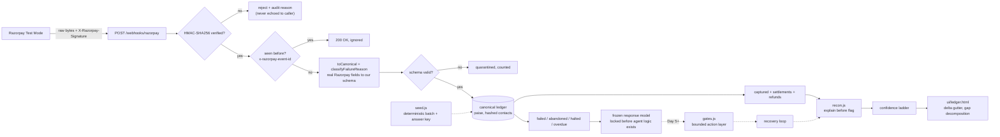

# AXIOM RECOVER

**An AI agent that recovers at-risk revenue for a Razorpay merchant — and proves, with numbers, that it actually worked.**

Built for the Razorpay AI Buildathon, Track 3 (AI Revenue Recovery), with Track 4 (AI Finance Controller) built in as the measurement layer.

---

## What this project does (for everyone)

When a customer's payment fails, or a checkout is abandoned, or an invoice goes unpaid, that money is usually gone unless someone follows up. Doing that follow-up well — at the right time, in the right way, without annoying or overcharging the customer — is hard to do by hand at scale.

This project is an AI agent that:

1. **Watches** for payments that failed, checkouts that were abandoned, subscriptions that stopped, and invoices that are overdue.
2. **Decides** the right next step for each one — retry the charge, send a payment link, send a reminder, or hand it to a human — based on why it failed and how the customer has responded before.
3. **Acts** inside strict limits: a spending cap, a maximum number of attempts, a "do not contact" list that is never overridden, and a requirement that every action be approved in advance if it's above a certain amount.
4. **Checks its own work** afterward by reconciling the outcome against the settlement records, the same way an accountant would.
5. **Reports honestly**: not just money recovered, but money recovered *after* subtracting the cost of the outreach and the cost of any customers who were lost because they were contacted too much.

The last point matters most. A system that spams every customer will look great on a simple "amount recovered" chart and be quietly damaging the business. This project measures the version of success that actually matters to a business: **net recovery**, not gross.

## Why this is trustworthy, not just a demo

Most hackathon projects show one successful run and call it done. Three specific things were done differently here, because they are the difference between a demo and something a business could actually rely on:

**1. The test data's "customer" was built before the agent was.**

To measure an agent, you need a stand-in for how a real customer would respond. If that stand-in is written or adjusted *after* seeing how the agent performs, the test is biased in the agent's favor without anyone intending it to be. To prevent that, the customer-response model in this project was finished and locked (see `model/response-model.frozen.js`) before any of the agent's decision-making logic was written. This is not just a promise in this document — it is enforced by a script (`npm run check`) that will fail if that file is ever changed afterward.

**2. Every assumption behind the test data must have a source.**

The customer-response model relies on assumptions like "how likely is a retried payment to succeed on the second attempt." These numbers need to come from somewhere real, not guesswork. The project includes a checklist (`server/model/base-rates.json`) where every one of these assumptions must be filled in with a citation before the results can be called final. Right now, these are placeholder estimates — filling in real sources is the next step before this can be presented as a finished result.

**3. The headline number is money recovered *minus* costs, compared to a simple baseline.**

Instead of just reporting "₹X recovered," this project always compares the agent against a simple baseline approach (retrying every failed payment automatically, with no intelligence) on the exact same set of test customers. The number that matters is the *difference* between the two — and that difference is reported after subtracting the cost of every message sent and the estimated cost of customers lost due to over-contacting.

## Current status

This is an active build. Here is exactly what is finished and what is not, so there is no ambiguity about what has been tested versus what is planned.

| Piece | What it does | Status |
|---|---|---|
| Test data generator | Creates a realistic, repeatable set of test transactions with a built-in answer key | Done, tested |
| Customer-response model | Simulates how a test customer would respond to each action, locked before agent logic exists | Done, locked |
| Payment security layer | Verifies that incoming payment notifications are genuinely from Razorpay and not forged | Done, tested |
| Razorpay connection | Sends requests to Razorpay's test system safely, with no risk of double-charging | Done, tested |
| Automated tests | 72 checks that confirm the above claims are actually true | All passing |
| Reconciliation engine | Matches payments to settlements, explains gaps, triages what's left | Done, tested |
| Gate layer (money firewall) | Every bounded/gated guarantee, enforced and unit-tested independently | Done, tested |
| Recovery loop | The agent logic that calls the gate layer and executes | In progress |
| Ledger console | A single-file screen showing every tie-out, its evidence, and the queue | Done |
| Recovery dashboard | Live view of the agent choosing and executing actions | In progress |
| Sourced assumptions | Replacing placeholder estimates with cited real-world figures | In progress |

## Architecture



Dashed arrows are not built yet. This diagram is corrected as the system grows rather than drawn once at the start and left to go stale — the two solid-arrow halves above (webhook ingestion and reconciliation) are real and tested; the dashed half (the recovery agent itself) is Day 5 onward.

---

## A finding worth its own section: two mandates that look identical and aren't

While extending the failure-reason taxonomy, checking it against Razorpay's actual subscription behaviour surfaced something the first version of this model got wrong by collapsing it into one bucket.

**"The subscription's mandate stopped working" is not one situation — it's three, with three different remedies:**

| Reason | What happened | Who can fix it |
|---|---|---|
| `mandate_revoked` | Customer cancelled consent at their bank/UPI app entirely | Nobody — it's dead |
| `mandate_paused_by_customer` | Customer paused it themselves, through their own consent flow | Only the customer — Razorpay's API will not let a business force this |
| `mandate_paused_by_business` | The business paused it (a billing hold, a plan change) | The business — but only through an API call this project doesn't implement yet |

The first version of this project had one `mandate_revoked` bucket covering all three. That's a real defect, not a stylistic simplification: it would tell an automated agent to write off a subscription that a single API call could have fixed, and it would tell the agent to keep messaging a customer who was never the one blocking anything in the first place.

**How the model now handles each one:**

- Attempting to charge any of the three is hard-blocked at zero probability — not "unlikely," genuinely zero, enforced as a rule rather than a calibratable number, because there is no live authorisation for a retry to use against a suspended mandate.
- A customer-paused mandate can still be *nudged* — a message can prompt the customer to resume it themselves, since only they hold that switch.
- A business-paused mandate cannot be usefully nudged *or* charged. Messaging the customer accomplishes nothing, because the customer was never the blocker. The model reports zero recoverability through every intervention this project currently has — which is not a gap being hidden, it's the honest way of saying **this record's only correct action is escalation to a human who can make the API call**, and it will stay that way until a `RESUME_SUBSCRIPTION` action exists.

This last point is a deliberate design choice: rather than special-casing "if reason is business-paused, force escalate" somewhere in future agent logic, the numbers themselves already make escalation the only sensible choice. A future policy layer that tries every intervention on this record type will observe 0% success on all of them and shouldn't need a hardcoded rule to figure out what to do next.

**A third bug this surfaced, caught by testing rather than by inspection:** at 400 synthetic records, `mandate_paused_by_business` occurred zero times. Its declared share is 1% of failure reasons, and it only survives at all when the same record also draws the e-mandate payment method (a 14% share) — a joint probability of roughly 0.14%. This is the exact same failure mode as the settlement break-classes bug from Day 1 (`BREAK_MIX`), showing up again in a different part of the generator. The fix follows the same pattern: the rare reason is now guaranteed to appear at least once per batch, and the batch summary discloses when that guarantee had to fire (`mandate_reasons_forced` in `truth.json`) rather than silently forcing it without saying so.

---

## Results so far: the reconciliation engine

Reconciliation is the part of this project that can be measured honestly, because the test data ships with an answer key written before the matching logic existed. Recovery depends on a *simulated* customer and cannot make that claim — which is exactly why the reconciler carries the measurement burden for the whole project.

### What it does

For every captured payment, it compares what actually settled in the bank against what should have settled, and then does the thing that separates a useful reconciler from a noisy one: **before flagging a gap, it tries to explain it.**

Two of the eight problem types in the test data are not losses at all. A payment can settle across two different bank batches, and a refund can be deducted before settlement. Both look identical to a shortfall if you compare one payment to one line and stop there. Flagging them means a person spends an afternoon confirming that nothing was wrong.

So every payment lands on one of these rungs, and the rung is reported:

| Outcome | Meaning | Goes to a human? |
|---|---|---|
| `exact` | Settles to the paisa | No |
| `explained_split` | Two bank batches, sums correctly | No |
| `explained_refund` | Gap equals a refund already on file | No |
| `explained_fee` | Gap is a pricing-plan variance | Yes — low priority |
| `flagged_duplicate` | Customer charged twice, refund owed | Yes — high priority |
| `unexplained` | Genuine break | Yes — high priority |
| `orphan_credit` | Money arrived with no payment behind it | Yes — high priority |

### Measured across 25 independent test datasets

| Metric | Result |
|---|---|
| Precision (of what we flagged, how much was real) | 100.0% |
| Recall (of what was real, how much we caught) | 100.0% |
| Explanation accuracy (right verdict *and* right reason) | 98.2% ± 1.4% |
| False positives | 0 |
| False negatives | 0 |
| Exceptions raised per dataset | 19.8 ± 3.6 |

**The 100% figures deserve suspicion, and here is the honest reading of them.** They say the flag / don't-flag rule is sound *on the eight problem types this generator produces*. They say nothing about a ninth type nobody thought to enumerate, which is what real settlement files always contain. The 98.2% explanation accuracy is the more informative number, because it is the one that is not perfect — and the reason it isn't is documented below.

There is a test in the suite that **fails if explanation accuracy ever reaches 100% across every dataset**, on the grounds that a perfect score there would mean the threshold had been quietly fitted to the answer key rather than reasoned about.

### Two design bugs the first run exposed

**Bug 1 — "I can explain this" was being confused with "nobody needs to see this."** The first version scored 56% recall. Five of the seven misses were pricing-fee variances that the engine had explained away as normal. But an explainable shortfall is still money the merchant didn't receive — it needs someone to confirm the pricing plan, just not with the same urgency as a duplicate charge. The fix was to keep it as an exception and give it a severity, which is what makes the queue *triaged* rather than a flat pile someone has to re-sort by hand.

The alternative fix would have been to relabel fee variances as "fine" in the answer key. That would have moved recall to 93% and meant nothing, because the key would have been edited to match the result.

**Bug 2 — Only half of each duplicate pair was being reported.** When a customer is charged twice, the engine found the pair correctly but only reported the second charge. That scored as a miss, and more importantly it left an operator with the same puzzle they started with. Both rows are now reported, labelled `original` and `duplicate`, so the decision is on screen rather than one search away.

### The one threshold, and why it isn't tuned

The engine has exactly one adjustable number: how large a shortfall can be, relative to the transaction fee, before it stops counting as a pricing variance and starts counting as a real break. `npm run sweep:band` prints the full trade-off curve for that number rather than presenting a single figure that appeared from nowhere.

The curve flattens past 60%, and that flatness is an artefact of the test data generator, not a property of real settlement files — the generator draws fee variances in a fixed range, so a wide enough band captures all of them and widening it further changes nothing. Real variances have no such ceiling. **60% is shipped because it is the narrowest band that clears the generator's stated range, not because the curve has a peak there.**

### Known limitation

Roughly 1 in 80 payments has a small mismatch that could plausibly be either a fee variance or a genuine amount error. The two overlap in size and there is no rule that separates them cleanly. Inventing one tuned to this dataset would be fitting the answer key rather than reconciling. The overlap is left in place, counted, and reported in the explanation-accuracy figure.


---

## The ledger console

`npm run ui` builds `ui/ledger.html`. Open it by double-clicking — no server, no install, no network.

The interface is deliberately not a dashboard. A reconciliation is a *document*: two columns that either tie out or don't. So the screen is built as a ledger, and the central question is asked in the layout itself — what should have settled, on the left; what actually settled, on the right; and the difference between them in the channel down the middle.

**The delta gutter.** Every payment's difference is drawn to scale from a centre line: left is short, right is over, and a row that ties out draws nothing at all. Scanning that one column shows the shape of a batch before a single figure is read. Bar length is on a square-root scale, because a linear one lets a single large break flatten every small one into invisibility — and small breaks are exactly the ones a person would otherwise miss.

**Colour carries the verdict and nothing else.** Three states: tied out, explained but still owed, needs a person. Nothing on the page is coloured for decoration.

**The difference is decomposed, not just reported.** Under the tie-out, a bar splits the total gap across those three states, and the parts sum back to the whole. Rows that tied out contribute exactly ₹0.00 to it. A reconciler that reports a total it cannot break down is reporting a number rather than a result.

**The page does no arithmetic.** Every figure comes from `recon.js` and `sweep.js` — the same code the test suite exercises. The console formats and arranges; it does not calculate. A dashboard that does its own maths is a second implementation nobody tests.

The scorecard reports the 25-batch sweep rather than the single batch on screen, because one batch is an anecdote and should not be dressed as a measurement just because it happens to be the one being displayed. The header shows whether the run is reportable yet — the same citation gate the command line enforces, surfaced where a reviewer can see it.

---

## The gate layer: "bounded and gated," made concrete

`gates.js` is the one place in this project that is allowed to say whether a proposed action may actually run. Every guarantee below is enforced there, tested independently, and demonstrated in `npm run gates:demo` — seven scenarios, each engineered to trip exactly one gate, with the full trace printed.

| Gate | What it enforces |
|---|---|
| Kill switch | Everything stops, unconditionally, the moment it's engaged — no exceptions carved out |
| Action allowlist | A proposed action outside the closed vocabulary is coerced to doing nothing, never guessed into the nearest match |
| Do-not-contact | Absolute, no override path — blocks messaging, never blocks a silent retry |
| Mandate charge block | The same "cannot charge a suspended mandate" rule from the frozen model, enforced *again*, independently, at execution time |
| Business-paused routing | A business-paused mandate can't be fixed by messaging the customer, so it goes straight to a human instead of wasting a contact attempt |
| Attempt ceiling | Stops retrying after a configured maximum; small amounts write off, large amounts still go to a human |
| Cooldown | A minimum wait since the last attempt — pacing, not a probability judgement |
| Quiet hours | No customer-facing message outside 9 AM–7 PM IST |
| Approval ceiling | Amount alone can force human review, regardless of what else passed |
| Spend caps (run + day) | Further paid actions reroute to a human once either cap is reached |

### Why the trace matters more than the verdict

Every gate pushes exactly one entry to the trace, every time — pass or block — including the nine gates that had nothing to say about a particular action. A trace that only records failures invites the question "were the others actually checked?" This one is built so that question doesn't need asking: `npm test` includes a check that every trace contains all eleven gate names, in order, on every single call.

### Two independent copies of the same rule, on purpose

The rule "a suspended e-mandate cannot be charged" exists twice in this codebase — once in `model/response-model.frozen.js`, where it keeps the *scoring* honest, and again in `gates.js`, where it keeps *execution* honest. These are different files, checked by different tests, and one is proven not to depend on the other: a test tampers with the frozen model's recoverability number, sets it to a wrong, "should definitely work" value, and confirms the gate still blocks the charge anyway. A bug in either copy alone still can't produce a duplicate or impossible charge.

### The quiet-hours citation, and its honest limit

The 9 AM–7 PM window is the intersection of two regulatory sources, not a number picked for the demo:

- RBI's Fair Practices Code restricts loan-recovery-agent contact to 8 AM–7 PM.
- TRAI's Telecom Commercial Communications Customer Preference Regulations restrict promotional calls and messages to 9 AM–9 PM.

Neither one cleanly covers what this project actually does. RBI's code governs regulated lenders collecting *loans* — a merchant chasing a *failed e-commerce payment* isn't that, so it isn't strictly bound by it. TRAI's window applies to *promotional* communication, and a payment-recovery nudge is arguably *transactional* in TRAI's own taxonomy, which could exempt it entirely. Rather than picking whichever reading is more convenient, this project takes the **intersection** of both cited windows as the conservative default — 9 AM–7 PM — and says so, instead of quietly claiming a compliance guarantee it hasn't verified with a lawyer.

### What is deliberately outside this file

`gates.js` decides. It does not execute, and it does not remember anything between calls — recording that an attempt happened or that money was spent is the executor's job, done only *after* an action actually runs. Keeping the decision function free of side effects is what makes it possible to unit-test every gate in isolation, calling it hundreds of times with fabricated histories, without ever touching a real spend counter or a real webhook.

The actual recovery loop that calls this file, executes the allowed action, and feeds the outcome back into the reconciler is the next piece being built.

---

## For technical reviewers

### Quick start

Requires **Node.js 22 or later**. No external dependencies to install.

```bash
cd server
cp .env.example .env
# Generate a random value for CONTACT_SALT and paste it into .env:
node -e "console.log(require('crypto').randomBytes(32).toString('hex'))"

npm test             # runs all 72 automated checks
npm run seed         # generates a reproducible test dataset + answer key
npm run recon        # reconciles that dataset and scores itself against the answer key
npm run sweep        # repeats the above across 25 independent datasets
npm run ui           # builds the ledger console into ui/ledger.html
npm run gates:demo   # 7 scenarios, each tripping exactly one gate, full trace printed
npm run check        # verifies the locked model hasn't changed, and checks citations
npm start            # starts the server that receives Razorpay webhooks
```

Running `npm run seed` with the same seed number always produces the exact same test data, on any computer. This is verified by an automated test, not just claimed.

### Project structure

```
axiom-recover/
├── README.md                          this file
└── server/
    ├── .env.example                   template for required configuration
    ├── package.json                   scripts and project metadata
    ├── index.js                       receives and verifies Razorpay webhooks
    ├── seed.js                        generates the test dataset + answer key
    ├── freeze.js                      locks the test model, checks citations
    ├── lib/
    │   ├── rng.js                     reproducible random number generation
    │   ├── schema.js                  defines and validates the data format
    │   ├── verify.js                  Razorpay signature verification, contact privacy
    │   └── rzp.js                     safe wrapper around the Razorpay API
    ├── model/
    │   ├── response-model.frozen.js   the locked customer-response simulation
    │   ├── base-rates.json            assumptions behind that simulation (needs citations)
    │   └── FROZEN.json                proof that the model above hasn't been altered
    └── test/
        └── smoke.js                   72 automated checks
```

### Key engineering decisions

**All money is stored as whole paise (e.g. ₹100.00 is stored as `10000`), never as rupees or decimals.** Computers cannot represent decimal fractions like 0.1 exactly, which causes small but real rounding errors in financial software. Using whole numbers for the smallest currency unit avoids this entirely. There is an automated test confirming that a decimal amount is rejected outright.

**No real request to Razorpay is ever sent unless explicitly turned on.** By default, everything runs in a safe "simulation" mode. Going live requires an explicit setting (`RAZORPAY_LIVE=true`), and the system additionally refuses to run at all if it detects a live (production) API key was provided by mistake, unless that is separately and explicitly confirmed.

**Every payment action carries a unique, repeatable identifier that prevents duplicate charges.** If the same action is accidentally triggered twice — for example, due to a network retry — the system recognizes it as the same action and does not repeat it. This is one of the most important protections in any system that moves money automatically.

**Customer phone numbers and emails are never stored in readable form.** They are converted into a one-way scrambled value (a cryptographic hash) before being saved anywhere. This value cannot be reversed back into the original phone number or email.

**Incoming Razorpay notifications are cryptographically verified before being trusted.** This confirms that a notification claiming to be from Razorpay is genuinely from Razorpay, and has not been tampered with in transit.

### Two issues found and fixed during testing

Both are documented here rather than hidden, because a project that only shows its successes doesn't show how it actually works.

**Issue 1 — Test data wasn't as repeatable as claimed.** The very first version of the test-data generator used the computer's current time as part of its calculations. This meant running it twice, a second apart, produced slightly different results — which defeated the purpose of having "repeatable" test data. This was fixed by using a fixed reference date instead of the live clock.

**Issue 2 — Rare but important test cases were sometimes missing.** With a small test dataset, some of the rarer (but important) situations — like a customer being accidentally charged twice — would sometimes not appear at all, purely by chance. This was fixed by guaranteeing that every important scenario appears at least once in every test run, while keeping everything else random and realistic.

### What is not yet finished

- The current assumptions in `base-rates.json` are reasonable placeholder estimates, not yet backed by cited sources. This is flagged automatically by `npm run check`, which will not allow results to be called final until this is resolved.
- The recovery loop that actually calls the gate layer, executes the allowed action against Razorpay, and feeds the outcome back into the reconciler is still being built. The gate layer itself (`gates.js`) is finished and tested.
- The visual dashboard for the recovery side (as opposed to the reconciliation side, which `ui/ledger.html` already covers) is still being built.
- The mapping between Razorpay's real webhook format and this project's internal data format should be checked against Razorpay's current API documentation before connecting to live data, as APIs can change over time.
- Spend-cap and approval-ceiling figures in `gates.js` (₹5,000 per run, ₹20,000 per day, ₹10,000 auto-approval threshold) are placeholder business decisions, not citations — unlike the quiet-hours window, nothing regulatory pins these numbers, and they should be set deliberately before this runs against a real merchant's book.

---

## License

MIT — see `LICENSE`.
